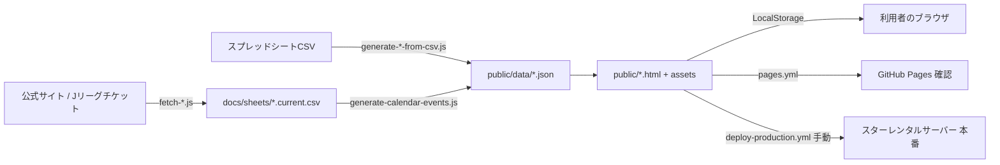

# プロジェクト概要

京都サンガF.C.のサポーター向けに、非公式のWebツールを公開するプロジェクトです。年間スケジュールの確認と参戦予定の保存、予想スカッド画像の作成、チケット販売開始とキックオフを時系列で並べるSUPPORTER TIMELINE、過密日程カレンダー、求・譲投稿フォーマットを提供します。すべてスマートフォンでの利用を最優先し、個人の状態はLocalStorageにだけ保存します。公式サイトのチケット販売スケジュールとニュース一覧は、GitHub Actionsが1日1回だけ読み取り、差分をPRとして提案します。

## 現在の技術構成

| 分類 | 技術 | 用途 | 根拠となるファイル |
| --- | --- | --- | --- |
| 言語 | HTML / CSS / JavaScript（ES Modules、ビルドなし） | 公開ページと検証スクリプト | `public/*.html`、`public/assets/*.js`、`tools/*.js`、`tools/*.mjs` |
| 言語 | Python 3 | ホテル候補データ生成の初期スキャフォールド（未稼働） | `tools/hotels/*.py`、`tools/hotels/requirements.txt` |
| 言語 | Python 3 + PyMuPDF（AGPL-3.0、同梱せず手元の仮想環境に入れる） | スタジアム座席図PDFから座席配置 `layout.json` を作る開発用ツール。画面とCIからは使わない | `experiments/stadium-3d/extract/`、`THIRD_PARTY_NOTICES.md` |
| ランタイム | Node.js 20 | 検証・生成スクリプトの実行。npm依存なし | `package.json`（`dependencies` なし、lockファイルなし）、`.github/workflows/*.yml` の `node-version: '20'` |
| フレームワーク | なし（素のDOM操作） | 公開ページはフレームワーク・バンドラを使わない | `public/assets/app.js`、`public/assets/squad-builder.js` |
| UI | 自作CSS、共通トップバー、同梱フォント DM Serif Display | 公開ページの見た目 | `public/assets/style.css`、`public/assets/topbar.css`、`public/assets/dm-serif-display-latin.woff2` |
| UI | modern-screenshot 4.6.5（MIT、静的同梱） | スカッド・日程のPNG生成 | `public/assets/vendor/modern-screenshot/`、`THIRD_PARTY_NOTICES.md` |
| UI | three.js 0.170.0（MIT、jsDelivrから読込、同梱なし） | サンガスタジアム 座席ビューの3D（プロトタイプのみ。`public/` からは読まない） | `experiments/stadium-3d/prototype.html`、`THIRD_PARTY_NOTICES.md` |
| データ保存 | 静的JSON（公開データの正本） | 日程53件、選手39件、ツール一覧、タイムライン用イベント | `public/data/matches.json`、`public/data/players.json`、`public/data/tools.json`、`public/data/calendar-events.json`（生成物） |
| データ保存 | CSV（運用データ・取り込み結果） | チケット販売、アウェイ席、ニュースの現在値と履歴スナップショット | `docs/sheets/*.csv` |
| データ保存 | ブラウザLocalStorage | 参戦予定、表示設定、スカッド保存など個人状態 | `public/assets/app.js`、`public/assets/squad-builder.js`、`docs/personalization.md` |
| 外部サービス | 京都サンガF.C.公式サイト（読み取りのみ） | チケット販売スケジュール、ニュース一覧・記事の取得 | `tools/fetch-ticket-sales.js`、`tools/fetch-news-list.js`、`tools/fetch-news-articles.js` |
| 外部サービス | Jリーグチケット（読み取りのみ） | アウェイ席の販売状態と発売日時の取得 | `tools/fetch-away-tickets.js`、`tools/fetch-away-sales.js` |
| 外部サービス | 楽天トラベルAPI（未稼働） | ホテル候補データ。現状は固定サンプル出力 | `tools/hotels/rakuten_client.py`、`tools/hotels/README.md` |
| 配信 | iCalendar フィード | タイムラインのカレンダー購読 | `public/timeline.ics`、`public/timeline-events.ics`、`tools/build-ics-feed.js` |
| インフラ・配信 | スターレンタルサーバー（FTP） | 本番公開先。手動ワークフローで `public/` だけを同期 | `.github/workflows/deploy-production.yml`（SamKirkland/FTP-Deploy-Action v4.4.0）、`docs/deploy-policy.md` |
| インフラ・配信 | GitHub Pages | 本番反映前の確認環境。`public/` と `experiments/` を配置 | `.github/workflows/pages.yml` |
| CI | GitHub Actions | 静的検証、スカッドのChromium検証、日次データ取り込み、本番からの取り込み | `.github/workflows/static-checks.yml`、`squad-checks.yml`、`ticket-sales-sync.yml`、`import-production-files.yml` |
| テスト | 自作Node.jsスクリプト（`node --check` と検証ツール） | JS構文、データ契約、公開アセット参照、版数、生成物の一致 | `package.json` の `check:*`、`tools/validate-*.js`、`tools/check-*.mjs` |
| テスト | Playwright 1.62.0 + Chromium（CIで都度インストール） | スカッドの実ブラウザレイアウト検証 | `.github/workflows/squad-checks.yml`、`tools/check-squad-layout.mjs` |
| テスト | 検証用FTPサーバー | 本番取り込みスクリプトの動作確認 | `tools/check-import-tools.mjs` |
| 開発ツール | `tools/asset-versions.mjs` | CSS/JS/JSON/画像の `?v=` を内容ハッシュで揃える | `package.json` の `fix:asset-versions` |
| 開発ツール | `tools/generate-dom-inventory.mjs` | DOMフック一覧 `docs/dom-inventory.md` を実装から生成 | `package.json` の `docs:dom-inventory` |
| 開発ツール | Claude Code スキル humanizer-ja | 公開ページの日本語文言の推敲 | `.claude/skills/humanizer-ja/` |

Lint、フォーマッター、TypeScript、バンドラは使われていません。空白エラーは `git diff --check` でCIが確認します。

## アーキテクチャ

静的サイトと、それを支えるNode.jsスクリプト群、GitHub Actionsの三層です。

- **公開ページ（`public/`）**: 各HTMLが `public/assets/` のCSS/JSを読み、`public/data/` のJSONを `fetch` して描画します。サーバー側の処理はありません。個人状態はLocalStorageに保存し、公開JSONへは含めません。
- **データ生成（`tools/`）**: スプレッドシート由来のCSVから日程・選手JSONを生成します。公式サイトとJリーグチケットから取得したHTMLをCSVに解析し、`generate-calendar-events.js` が `matches.json` と合わせて `calendar-events.json` とICSフィードを組み立てます。
- **自動化（`.github/workflows/`）**: `ticket-sales-sync.yml` が毎日22:00 JSTに取得・解析・生成・検証を行い、差分があればドラフトPRを作ります。手で確かめるアウェイ戦はIssue1本を書き換えて知らせます。取り込みPRは常に1本だけにし、未マージが3日続くか取得が2回続けて失敗したら、別のIssue1本でメンション付きで知らせます。`static-checks.yml` がPRごとに `npm run check:static` と、文書以外の変更時にスカッドのChromium検証を走らせます。
- **配信**: `main` へのpushでGitHub Pagesへ確認用に配置し、本番は `deploy-production.yml` を `DEPLOY` 入力付きで手動実行します。デプロイ前に本番ファイルを暗号化して退避し、`public/` だけをFTPで差分同期します。



## 重要な設計判断

- **依存パッケージを持たない**: `package.json` に `dependencies` がなく、lockファイルもありません。検証は `node --check` と自作スクリプトで完結させ、手元とCIで同じ `npm run check:*` を呼びます。ワークフローYAMLへ検証コマンドを直接書かない方針です（`AGENTS.md`「基本検証」）。
- **Playwrightはリポジトリに入れず、CIで都度インストール**: `squad-checks.yml` が `npm install --no-save --package-lock=false` で固定版を入れます。手元での実ブラウザ検証は任意です。
- **modern-screenshot をCDNではなく静的同梱**: iOS Safariでの画像生成の安定と、公開物の自己完結のためと読めます。`THIRD_PARTY_NOTICES.md` にライセンス表示を集約しています（同梱に切り替えた理由の記録は未確認）。
- **公式サイトへの負荷を抑える**: `robots.txt` の `Crawl-delay: 10` に従い、1日1回・1リクエスト、ステップ間に `sleep 10` を置きます（`ticket-sales-sync.yml` のコメント、`docs/supporter-timeline-design.md`「公式サイトの利用条件」）。
- **失敗を沈黙させない**: アウェイ・ニュース取り込みは `continue-on-error` で本流を止めない一方、最後のステップでジョブを失敗させます。2026-08-31から10日間の失敗に気付けなかった経緯が根拠です。
- **本番デプロイは手動のみ**: 自動デプロイは行わず、`main` かつ `DEPLOY` 入力を要求します。デプロイ前に暗号化バックアップを必須にします（公開リポジトリのアーティファクトは誰でも取得できるため）。
- **LocalStorageの互換性を守る**: 既存キー・保存形式を移行方針なしに変えません。スカッドは新 `squad` 形式を保存しつつ旧 `bench` 形式を読みます（`docs/project-structure.md`）。
- **UIを伴う変更は `experiments/` で先に試す**: 公開物の正本は `public/` で、`experiments/` はGitHub Pagesでだけ参照できます（`docs/ui-prototype-workflow.md`）。
- **CSS/JS/JSONのキャッシュ版数は内容ハッシュ**: 生成物と参照の版数ずれで2日続けてCIが落ちた経緯から、`generate:timeline:public` が `fix:asset-versions` まで実行します。
- **公開ページの日本語は humanizer-ja で推敲**: 書く人や道具が変わっても同じ基準で読めるよう、スキルをリポジトリ内に置いています（`.claude/skills/humanizer-ja/README.md`）。
- **フレームワークを使わない理由**: 理由未確認。実装上はビルド不要で `public/` をそのまま配置できる利点があります。

## 実行と検証

- **開発環境の起動**: ビルドは不要です。`python3 -m http.server 8123 --directory public` のような静的サーバーで `public/` を配信して確認します（CIと同じ方法）。
- **テスト**:

```bash
npm run check            # check:static と check:squad
npm run check:static     # 日程ページ、タイムライン生成物、公開アセット、取り込みスクリプト
npm run check:squad      # 予想スカッドの構文・データ・静的契約
npm run check:timeline   # チケット販売・アウェイ・ニュース解析と calendar-events
BASE_URL=http://127.0.0.1:8123/squad.html npm run check:squad:browser   # Playwright必須
```

- **生成**: `npm run generate:timeline:public`（`calendar-events.json`、ICS、版数を更新）、`npm run docs:dom-inventory`、`npm run fix:asset-versions`。
- **ビルド**: なし。`public/` が配信物そのものです。
- **デプロイ**: `main` へのpushでGitHub Pagesへ自動配置。本番は GitHub Actions「本番サーバー手動デプロイ」を `confirm=DEPLOY` で手動実行します。明示的な指示がある場合だけ実行します。
- **必要な環境変数名（GitHub Secrets）**: `STAR_SERVER_HOST`、`STAR_SERVER_USER`、`STAR_SERVER_PASSWORD`、`STAR_SERVER_PROTOCOL`、`STAR_SERVER_PORT`、`STAR_SERVER_REMOTE_DIR`、`BACKUP_PASSPHRASE`。ホテルツールは `.env` に楽天API認証情報を置く想定です（`.env.example` は未確認）。値はリポジトリに書きません。

## ForLLMとの関連

- `[[AI・自動化]]` — 公式サイトの日次取り込みをGitHub Actionsで自動化し、差分をPR・Issueとして人に渡す運用を実装しています。AIエージェント向けの指示（`AGENTS.md`、`docs/ai/`、`.claude/skills/humanizer-ja/`）も蓄積しており、エージェント運用の実例として参照します。
- `[[UI・デザイン]]` — スマートフォン最優先、44px程度の操作対象、色だけに頼らない表示、ダイアログのフォーカス管理など、公開ページのUI規則を適用する先です。`experiments/` のプロトタイプ運用も含みます。
- `[[開発・トラブルシューティング]]` — 依存なしのNode.js検証、Playwrightの実ブラウザ検証、FTPデプロイの再接続、CIの「失敗を沈黙させない」設計など、運用と障害対応の知識を蓄積します。

上記MOC名は本リポジトリ作成時にVaultを直接確認できていないため、Vault側の実際のMOC名に合わせて修正してください。

## 未解決事項

- **README と実装の不一致**: `README.md`（確認基準日 2026-08-26）は公開サイトを年間スケジュールと予想スカッドの2つとしていますが、`public/data/tools.json` と `docs/project-structure.md` では SUPPORTER TIMELINE、過密日程カレンダー、求・譲投稿フォーマット、入口ページも現役です。
- **THIRD_PARTY_NOTICES と実装の不一致**: `THIRD_PARTY_NOTICES.md` は `public/assets/app.js` が `esm.sh` から modern-screenshot を読み込むと記載していますが、実装は `./vendor/modern-screenshot/modern-screenshot.mjs` を読み込んでいます。`public/experiments/` も既に削除済みです。
- **リポジトリ直下の `undefined/` ディレクトリ**: 入口ページのスクリーンショットPNGが入っていますが、どの文書からも参照されていません。誤って生成された可能性があります。
- **ホテル候補連携**: `tools/hotels/` はサンプル出力のみで、`public/data/hotel-index.json` は0件です。楽天API連携を進めるか止めるかは未決定です。
- **公式由来のロゴ・背番号加工物の利用許諾**: `docs/source-and-license.md` で未確認のままです。
- **フレームワークやビルドツールを使わない判断の理由**: 文書に明示がなく、理由未確認です。
- **ルート `LICENSE` がない**: README が明記しています。方針は未決定です。
- **Node.js の版**: CIは20を指定していますが、手元の検証は22でも通りました。上限は未確認です。
